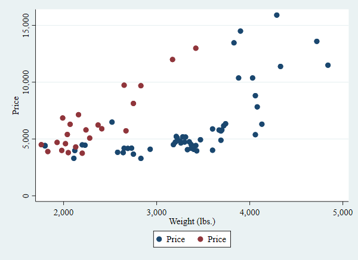
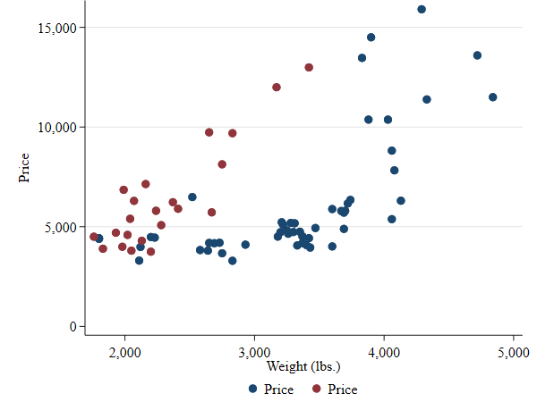

# stata-schemes

My personal Stata figure schemes (styles)

## Install

```stata
net install scheme-sergio, from(https://raw.githubusercontent.com/sergiocorreia/stata-schemes/main)
```

## Usage

```stata
set scheme sergio
// or
set scheme sergio, permanently
```


## Notes

- It is critical that you issue the `discard` command each time before you reissue your graph command.
- See `help scheme entries`


## Useful tutorials

- https://medium.com/the-stata-guide/covid-19-visualizations-with-stata-part-2-customizing-color-schemes-206af77d00ce
- [Customizing Stata graphs made easy (Ben Jann 2018 London Stata Conf)](https://www.stata.com/meeting/uk18/slides/uk18_Jann.pdf)
- [Brewing color schemes in Stata: Making it easier for end users to customize Stata graphs (Billy Buchanan, 2015 Stata Conf)](https://www.stata.com/meeting/columbus15/abstracts/materials/columbus15_buchanan.pdf)
- [Some help info](http://people.umass.edu/biostat690c/pdf/stata%20schemes%20and%20palettes.pdf)
- https://blog.stata.com/2018/10/02/scheming-your-way-to-your-favorite-graph-style/

## Useful schemes

- Clean plots: https://www.trentonmize.com/software/cleanplots
- `plottig` and `plottigblind` [sj article](https://uc6aad937ff63c1fcef25512ba37.dl.dropboxusercontent.com/cd/0/inline2/BJDxVAUzlZxv9oK6eX2FGX4m2dek_gNtBm1ECf_vVPKpJVja_XX_zk5vfN5ibYR0TOhb6fyjiKbJom-9-l4Yoxx7qoIFEr6lxE2T12kWAEoYJ_iSdf_r7TlLpMkGDGAWUT5sud6J5diuqTnl_xZPG3lrb5BqGvfWOVtKdJRmVNCrdn6BbES6QXeIP2rPx0foOpxcIbdm383b1lzpuoXkwKXWBZhTYxm5kkCr8WTqOYAd5PNs6r2_-n0JPLSV4VUhbiwwPfzmqq0fXSwwcE7yylMDKmkRKAaGbK6j6_aEpo5OFnNpi8gx_jcq_EVxWTpfkMl6AmokoQwX2GhT-FWvAR5x/file#)
- https://gray.kimbrough.info/uncluttered-stata-graphs/
- https://github.com/mdroste/stata-scheme-modern


## Screenshots

Default scheme (`s2color`):



This scheme:


